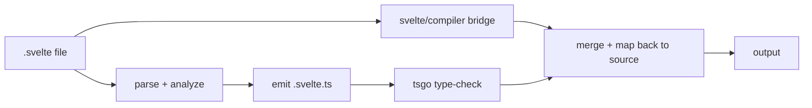

# svelte-check-native

Fast CLI type-checker for **Svelte 5+** projects. Drop-in replacement
for [`svelte-check`](https://www.npmjs.com/package/svelte-check) — same
flags, same output formats, same exit codes.

Powered by Rust + [tsgo](https://github.com/microsoft/typescript-go).

## Install

```sh
npm i -D svelte-check-native
```

Requires `@typescript/native-preview` (tsgo) and a `svelte` package in
your project's `node_modules`. `bun` or `node` on `PATH` is used to call
`svelte/compiler` for warnings.

## Use

```sh
svelte-check-native --workspace .
```

Same flags as upstream `svelte-check`. See `svelte-check-native --help`.

## Speed

On `a heavy SvelteKit TS app` (1206 `.svelte` files, M-series 8-core,
warm cache, median of 3 runs):

| | Warm |
|---|---|
| `svelte-check-native` | **~3 s** |
| `svelte-check --tsgo` | ~13 s |
| `svelte-check` (default) | ~40 s |

Cold (no cache, fresh `bun` import): ~7–8 s.

Diagnostic output is byte-equivalent to upstream `svelte-check` with
the same flags (verified parity: 0 errors / 10 warnings / 7 files on
the above workload).

## How it works



1. Parse each `.svelte` into script + template sections
2. Emit a `.svelte.ts` overlay file per source
3. Run `tsgo` once against an overlay tsconfig
4. Run `svelte/compiler` (via N parallel `bun`/`node` worker subprocesses)
   for compiler warnings
5. Map every diagnostic back to its `.svelte` line:column

The overlay cache lives at
`<workspace>/node_modules/.cache/svelte-check-native/` (gitignored
implicitly) — falls back to `<workspace>/.svelte-check/` if there is no
`node_modules/`.

## Flags

```
--workspace <path>            Project root (default: cwd)
--tsconfig <path>             Path to tsconfig.json (auto-discovered)
--output <fmt>                human | human-verbose | machine | machine-verbose
--threshold <level>           warning | error
--fail-on-warnings            Exit 1 when only warnings exist
--diagnostic-sources <list>   Subset of: js, svelte
--compiler-warnings <list>    code:severity[,code:severity...]
--ignore <globs>              Comma-separated git-style globs
--color / --no-color          Force ANSI on/off
--timings                     Print phase-by-phase wall-clock breakdown
--debug-paths                 Print resolved binaries, exit
--tsgo-version                Print tsgo version, exit
--emit-ts                     Print generated TypeScript per file, exit
```

Run `svelte-check-native --help` for the canonical list.

Output defaults to `machine` when run from a coding-agent CLI:
`CLAUDECODE=1` (Claude Code), `GEMINI_CLI=1` (Gemini CLI), or
`CODEX_CI=1` (OpenAI Codex CLI).

## Not included

- Watch mode — pair with `watchexec` or your editor
- LSP / autocomplete — use the official Svelte for VS Code extension
- Svelte 4 syntax (`export let`, `$:`, `<slot>`, `on:` directives)
- CSS linting (`--diagnostic-sources css` is hard-rejected)
- `tsc` fallback (tsgo is the only TypeScript backend)

## License

MIT
