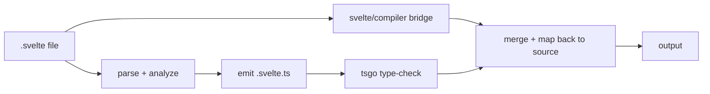

<div align="center">

  

  <h1>svelte-check-native</h1>

[](https://www.npmjs.com/package/svelte-check-native)
[](https://www.npmjs.com/package/svelte-check-native)

</div>

Blazing fast CLI type-checker for **Svelte** projects.
Drop-in replacement for [`svelte-check`](https://www.npmjs.com/package/svelte-check) — same flags, same output formats, same exit codes. Powered by Rust + [tsgo](https://github.com/microsoft/typescript-go). Made for all your ai agents and fast CI/CD pipelines.

| What it is                                  | What it isn't               |
| ------------------------------------------- | --------------------------- |
| CLI type-checker for Svelte 4 and 5         | An LSP / editor integration |
| Drop-in for `svelte-check` (flags + output) | A CSS linter                |
| Single Rust binary, tsgo-powered            | A formatter                 |
| Byte-identical diagnostics upstream         |                             |
| Incremental via tsgo's `tsbuildinfo`        |                             |

## Speed

Measured on a SvelteKit + TypeScript monorepo with
1359 `.svelte` files (Svelte 5 runes), M1 Pro 8C, mean of 2 runs each:

`svelte-check-native --tsconfig tsconfig.json --diagnostic-sources 'js,svelte'`

| Tool                    |      Cold |      Warm |     Dirty |   Speedup | Errors | Warnings | Files w/ issues |
| :---------------------- | --------: | --------: | --------: | --------: | -----: | -------: | --------------: |
| `svelte-check-native`   | **6.0 s** | **2.6 s** | **2.6 s** | **15.8×** |      1 |       44 |              16 |
| `svelte-check` 4.4.6    |    39.9 s |    41.0 s |    41.0 s |      1.0× |      1 |       44 |              16 |
| `svelte-check-rs` 0.9.7 |    15.0 s |     5.5 s |     4.4 s |      6.9× |    732 |       44 |             261 |

Diagnostic counts match `svelte-check` with same flags.

## Install

```sh
npm i -D svelte-check-native @typescript/native-preview
```

`@typescript/native-preview` is the tsgo binary — required at check
time, never imported at runtime.

## Use

```sh
svelte-check-native --workspace .
```

Same flags as `svelte-check`. See `svelte-check-native --help`.

## How it works



1. Parse each `.svelte` into script + template sections
2. Emit a `.svelte.ts` overlay file per source
3. Run `tsgo` once against an overlay tsconfig
4. Run `svelte/compiler` (via N parallel `bun`/`node` worker
   subprocesses) for compiler warnings
5. Map every diagnostic back to its `.svelte` line:column

## Flags

```
--workspace <path>            Project root (default: cwd)
--tsconfig <path>             Path to tsconfig.json (auto-discovered)
--output <fmt>                human | human-verbose | machine | machine-verbose
--threshold <level>           warning | error
--fail-on-warnings            Exit 1 when only warnings exist
--diagnostic-sources <list>   Subset of: js, svelte
--compiler-warnings <list>    code:severity[,code:severity...]
--ignore <globs>              Comma-separated git-style globs
--color / --no-color          Force ANSI on/off
--timings                     Print phase-by-phase wall-clock breakdown
--debug-paths                 Print resolved binaries, exit
--tsgo-version                Print tsgo version, exit
--tsgo-diagnostics            Print tsgo's perf/memory stats after the run
--emit-ts                     Print generated TypeScript per file, exit
```

Run `svelte-check-native --help` for the canonical list.

Output defaults to `machine` when run from a coding-agent CLI:
`CLAUDECODE=1` (Claude Code), `GEMINI_CLI=1` (Gemini CLI), or
`CODEX_CI=1` (OpenAI Codex CLI).

## Environment variables

- `TSGO_BIN` — override tsgo discovery; accepts an absolute path to a
  platform-native tsgo binary. Useful when `@typescript/native-preview`
  isn't in `node_modules` (e.g. a monorepo where tsgo lives elsewhere).
- `SVN_BRIDGE_WORKERS` — number of `svelte/compiler` worker
  subprocesses. Default `cores/2`, capped at 8; tracks the perf-core
  count on Apple Silicon. Override if you hit IPC contention on very
  large core counts.
- `CLAUDECODE` / `GEMINI_CLI` / `CODEX_CI` — any set forces `machine`
  output for agent-friendly parsing.

## Exit codes

- `0` — no errors (and no warnings if `--fail-on-warnings`)
- `1` — errors detected (or warnings with `--fail-on-warnings`)
- `2` — invocation error (bad flag, missing tsconfig, tsgo not found)

## Roadmap

- [ ] CSS support

## Troubleshooting

**Stale errors after editing `tsconfig.json` or path aliases** — wipe
the cache: `rm -rf node_modules/.cache/svelte-check-native` and re-run.
The overlay config is regenerated from your live tsconfig on every
run, but tsgo's `tsbuildinfo` can hold onto stale resolution state.

**TS2321 "Excessive stack depth"** on your own types — usually a
`UnionToRecord<T>` that round-trips through `UnionToTuple<T>[number]`.
Iterate `T` directly in the mapped-type key instead.

## Prior art

- [`svelte2tsx`](https://github.com/sveltejs/language-tools/tree/master/packages/svelte2tsx)
  / [`svelte-check`](https://github.com/sveltejs/language-tools/tree/master/packages/svelte-check)
  — transpiler + CLI whose output shape and flags we
  match. The `.v5` fixture corpus from `svelte2tsx` is our parity gate.
- [tsgo](https://github.com/microsoft/typescript-go) — the Go-based
  TypeScript compiler that does the actual type-checking. Shipped as
  `@typescript/native-preview`.

## License

MIT
